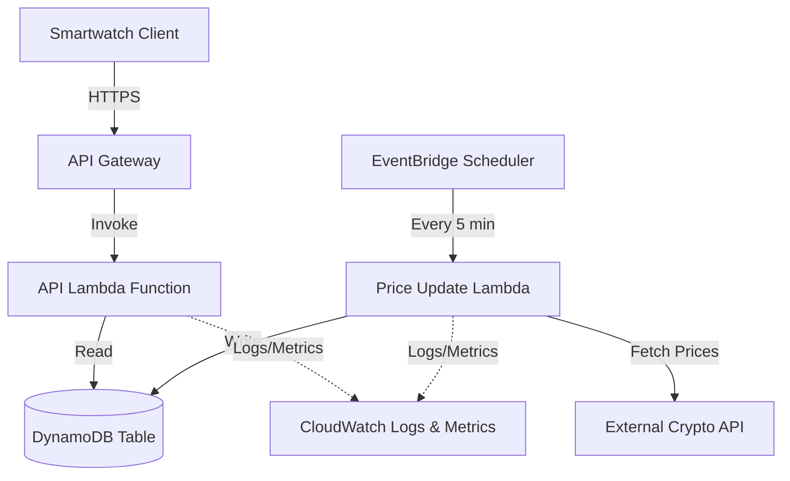

# 設計書

## 概要

crypto-watch-backendは、Lambda関数、API Gateway、DynamoDBを使用して構築されたサーバーレスAWSバックエンドです。このシステムは、スマートウォッチクライアント向けに最適化された暗号通貨価格データのRESTful APIを提供します。アーキテクチャは、スマートウォッチの制約に対応するため、低レイテンシ、効率的なキャッシング、最小限のデータ転送を重視しています。

バックエンドは2つの主要なLambda関数で構成されています：APIリクエストを処理する関数（読み取りパス）と、定期的に暗号通貨価格を更新する関数（書き込みパス）です。DynamoDBは、読み取り負荷の高いワークロードに最適化されたシングルテーブル設計のデータストアとして機能します。

## アーキテクチャ

### 高レベルアーキテクチャ



### コンポーネント間の相互作用フロー

**読み取りパス（APIリクエスト）:**
1. Smartwatch ClientがAPI GatewayにHTTPSリクエストを送信
2. API Gatewayがリクエストを検証し、API Lambdaを呼び出す
3. API LambdaがAPIキーを検証
4. API LambdaがDynamoDBでレート制限をチェック
5. API LambdaがDynamoDBからキャッシュされた価格データを取得
6. API Lambdaがフォーマットされたレスポンスをクライアントに返す

**書き込みパス（価格更新）:**
1. EventBridgeが5分ごとにPrice Update Lambdaをトリガー
2. Lambdaが外部暗号通貨APIから現在価格を取得
3. Lambdaがデータを変換・検証
4. Lambdaが更新された価格をタイムスタンプと共にDynamoDBに書き込む
5. LambdaがCloudWatchに成功/失敗メトリクスをログ記録

## コンポーネントとインターフェース

### API Gateway

**エンドポイント:**
- `GET /prices` - 指定された暗号通貨の現在価格を取得
- `GET /prices/{symbol}` - 単一の暗号通貨の価格を取得
- `GET /health` - ヘルスチェックエンドポイント（認証不要）

**リクエスト/レスポンス形式:**

```typescript
// GET /prices?symbols=BTC,ETH,ADA
Request Headers:
  X-API-Key: string
  Accept-Encoding: gzip (optional)

Response (200 OK):
{
  "data": [
    {
      "symbol": "BTC",
      "name": "Bitcoin",
      "price": 45000.50,
      "change24h": 2.5,
      "marketCap": 850000000000,
      "lastUpdated": "2024-01-15T10:30:00Z"
    }
  ],
  "timestamp": "2024-01-15T10:30:05Z"
}

Response (401 Unauthorized):
{
  "error": "Invalid API key",
  "code": "UNAUTHORIZED"
}

Response (429 Too Many Requests):
{
  "error": "Rate limit exceeded",
  "code": "RATE_LIMIT_EXCEEDED",
  "retryAfter": 60
}

// GET /health
Response (200 OK):
{
  "status": "healthy",
  "timestamp": "2024-01-15T10:30:00Z",
  "checks": {
    "dynamodb": "ok",
    "lastPriceUpdate": "2024-01-15T10:25:00Z",
    "cacheAge": 300
  }
}

Response (503 Service Unavailable):
{
  "status": "unhealthy",
  "timestamp": "2024-01-15T10:30:00Z",
  "checks": {
    "dynamodb": "error",
    "lastPriceUpdate": "2024-01-15T09:00:00Z",
    "cacheAge": 5400
  },
  "error": "DynamoDB connection failed"
}
```

### API Lambda Function

**Responsibilities:**
- Validate API keys
- Enforce rate limiting
- Retrieve cryptocurrency data from DynamoDB
- Format responses for smartwatch clients
- Handle errors gracefully

**Environment Variables:**
- `DYNAMODB_TABLE_NAME` - Name of the DynamoDB table
- `RATE_LIMIT_PER_MINUTE` - Maximum requests per minute (default: 100)
- `CACHE_TTL_SECONDS` - Cache time-to-live (default: 300)

**Handler Signature:**
```python
def lambda_handler(event: dict, context: LambdaContext) -> dict:
    """
    Handles API Gateway requests for cryptocurrency prices.
    
    Args:
        event: API Gateway event containing request details
        context: Lambda execution context
        
    Returns:
        API Gateway response with status code, headers, and body
    """
```

### Price Update Lambda Function

**Responsibilities:**
- Fetch current cryptocurrency prices from external API
- Transform data into internal format
- Update DynamoDB with new prices
- Implement retry logic with exponential backoff
- Log metrics and errors

**Environment Variables:**
- `DYNAMODB_TABLE_NAME` - Name of the DynamoDB table
- `EXTERNAL_API_URL` - URL of external crypto price API
- `EXTERNAL_API_KEY` - API key for external service
- `SUPPORTED_SYMBOLS` - Comma-separated list of cryptocurrency symbols

**Handler Signature:**
```python
def lambda_handler(event: dict, context: LambdaContext) -> dict:
    """
    Fetches and updates cryptocurrency prices from external API.
    
    Args:
        event: EventBridge scheduled event
        context: Lambda execution context
        
    Returns:
        Status information about the update operation
    """
```

### EventBridge Scheduler

**Configuration:**
- Schedule: `rate(5 minutes)`
- Target: Price Update Lambda Function
- Retry Policy: 2 retries with exponential backoff

## Data Models

### DynamoDB Table Design

**Table Name:** `crypto-watch-data`

**Primary Key:**
- Partition Key: `PK` (String)
- Sort Key: `SK` (String)

**Global Secondary Index (GSI):**
- GSI Name: `GSI1`
- Partition Key: `GSI1PK` (String)
- Sort Key: `GSI1SK` (String)

**Access Patterns:**

| Access Pattern | Key Condition |
|----------------|---------------|
| Get price by symbol | PK = `PRICE#{symbol}`, SK = `METADATA` |
| Get all prices | PK begins_with `PRICE#` |
| Check rate limit | PK = `APIKEY#{key}`, SK = `RATELIMIT#{minute}` |
| Get API key details | PK = `APIKEY#{key}`, SK = `METADATA` |

**Item Types:**

```typescript
// Price Data Item
{
  "PK": "PRICE#BTC",
  "SK": "METADATA",
  "symbol": "BTC",
  "name": "Bitcoin",
  "price": 45000.50,
  "change24h": 2.5,
  "marketCap": 850000000000,
  "lastUpdated": "2024-01-15T10:30:00Z",
  "ttl": 1705318200  // Unix timestamp for item expiration
}

// API Key Item
{
  "PK": "APIKEY#abc123",
  "SK": "METADATA",
  "keyId": "abc123",
  "name": "Production App",
  "createdAt": "2024-01-01T00:00:00Z",
  "enabled": true
}

// Rate Limit Item
{
  "PK": "APIKEY#abc123",
  "SK": "RATELIMIT#202401151030",  // minute-level granularity
  "requestCount": 45,
  "ttl": 1705318260  // Expires after 1 hour
}
```

### External API Integration

**Provider:** CoinGecko API (or similar)

**Request Format:**
```
GET https://api.coingecko.com/api/v3/simple/price
  ?ids=bitcoin,ethereum,cardano
  &vs_currencies=usd
  &include_market_cap=true
  &include_24hr_change=true
```

**Response Transformation:**
```python
# External API response
{
  "bitcoin": {
    "usd": 45000.50,
    "usd_market_cap": 850000000000,
    "usd_24h_change": 2.5
  }
}

# Transformed to internal format
{
  "symbol": "BTC",
  "name": "Bitcoin",
  "price": 45000.50,
  "change24h": 2.5,
  "marketCap": 850000000000,
  "lastUpdated": "2024-01-15T10:30:00Z"
}
```

## Correctness Properties

*A property is a characteristic or behavior that should hold true across all valid executions of a system—essentially, a formal statement about what the system should do. Properties serve as the bridge between human-readable specifications and machine-verifiable correctness guarantees.*

### Property 1: Complete response data structure
*For any* valid cryptocurrency price data, the formatted API response should include symbol, name, price, 24-hour percentage change, market cap, and lastUpdated timestamp for each requested cryptocurrency.
**Validates: Requirements 1.2, 1.3**

### Property 2: Cache freshness determines data source
*For any* price data request, if cached data exists with a timestamp less than 5 minutes old, the system should return cached data without fetching from external API.
**Validates: Requirements 2.1**

### Property 3: Cache invalidation triggers refresh
*For any* price data request, if cached data is older than 5 minutes or does not exist, the system should fetch fresh data from the external API.
**Validates: Requirements 2.2**

### Property 4: Timestamp persistence
*For any* price update operation, the data stored in DynamoDB should include a lastUpdated timestamp and a TTL value.
**Validates: Requirements 2.4, 3.2**

### Property 5: Response compression
*For any* API request that includes Accept-Encoding headers indicating compression support, the response should be compressed accordingly.
**Validates: Requirements 2.5**

### Property 6: Retry with exponential backoff
*For any* external API call that fails, the system should retry up to 3 times with exponential backoff delays between attempts.
**Validates: Requirements 3.3**

### Property 7: Retry exhaustion handling
*For any* external API call where all retry attempts fail, the system should log the error and attempt to serve cached data if available.
**Validates: Requirements 3.4**

### Property 8: Update timestamp tracking
*For any* successful price update operation, the system should record the timestamp of the successful update for monitoring purposes.
**Validates: Requirements 3.5**

### Property 9: Authentication requirement
*For any* API endpoint request (except health check), the system should validate the presence and validity of an API key before processing the request.
**Validates: Requirements 4.1**

### Property 10: Rate limit enforcement
*For any* API key, after 100 requests within a 60-second window, subsequent requests should be rejected until the window resets.
**Validates: Requirements 4.3**

### Property 11: Request logging
*For any* API request received, the system should create a log entry containing request details, timestamp, and API key identifier.
**Validates: Requirements 4.5**

### Property 12: Error logging with details
*For any* error that occurs during request processing, the system should log detailed error information including error type, message, and stack trace.
**Validates: Requirements 5.2**

### Property 13: DynamoDB retry logic
*For any* DynamoDB operation that fails with a transient error, the system should retry the operation, and for permanent failures, should return an appropriate error response.
**Validates: Requirements 6.3**

### Property 14: Timeout fallback behavior
*For any* external API call that times out, the system should check for cached data and return it if available, or return an error response if no cache exists.
**Validates: Requirements 6.4**

### Property 15: Consistent error response format
*For any* error response from any endpoint, the response should follow a consistent JSON structure with "error", "code", and optional additional fields.
**Validates: Requirements 6.5**


## Error Handling

### Error Categories

**Client Errors (4xx):**
- 400 Bad Request: Invalid request parameters (missing symbols, invalid format)
- 401 Unauthorized: Missing or invalid API key
- 429 Too Many Requests: Rate limit exceeded

**Server Errors (5xx):**
- 500 Internal Server Error: Unexpected errors in Lambda execution
- 502 Bad Gateway: External API failures after all retries
- 503 Service Unavailable: DynamoDB unavailable or throttled

### Error Response Format

All error responses follow a consistent structure:

```json
{
  "error": "Human-readable error message",
  "code": "ERROR_CODE_CONSTANT",
  "timestamp": "2024-01-15T10:30:00Z",
  "requestId": "uuid-v4",
  "details": {
    // Optional additional context
  }
}
```

### Retry Strategy

**External API Calls:**
- Initial attempt
- Retry 1: Wait 1 second
- Retry 2: Wait 2 seconds
- Retry 3: Wait 4 seconds
- After all retries fail: Log error, serve cached data if available

**DynamoDB Operations:**
- Use AWS SDK built-in retry logic
- Exponential backoff with jitter
- Maximum 3 retry attempts
- Distinguish between throttling (retryable) and validation errors (not retryable)

### Timeout Configuration

- API Gateway timeout: 29 seconds (AWS maximum)
- Lambda timeout: 25 seconds (allows time for cleanup)
- External API call timeout: 5 seconds per attempt
- DynamoDB operation timeout: 3 seconds

## Testing Strategy

### Unit Testing

The backend will use Python's `unittest` framework for unit tests. Unit tests will focus on:

- Request validation logic (parameter parsing, format validation)
- Response formatting functions
- Data transformation between external API format and internal format
- Error response generation
- Rate limiting calculation logic
- Cache TTL calculation
- Retry backoff calculation

Example unit tests:
- Test that invalid symbols are rejected with appropriate error messages
- Test that response formatter includes all required fields
- Test that rate limit counter correctly tracks requests per minute
- Test that cache age calculation correctly determines freshness

### Property-Based Testing

The backend will use the `hypothesis` library for property-based testing in Python. Property-based tests will verify universal properties across many randomly generated inputs.

Configuration:
- Each property test should run a minimum of 100 iterations
- Tests should use appropriate strategies for generating test data (symbols, timestamps, API responses)
- Each property test must include a comment tag referencing the design document property

Example property tests:
- Property 1: Generate random cryptocurrency data and verify formatted responses always include all required fields
- Property 2: Generate random timestamps and verify cache logic correctly determines when to use cached vs fresh data
- Property 6: Generate random failure scenarios and verify retry logic executes correct number of attempts with proper delays
- Property 10: Generate random request patterns and verify rate limiting correctly enforces limits

Property test tags must follow this format:
```python
# Feature: crypto-watch-backend, Property 1: Complete response data structure
def test_response_includes_all_fields(self, crypto_data):
    ...
```

### Integration Testing

Integration tests will verify:
- End-to-end API request flow through API Gateway to Lambda to DynamoDB
- EventBridge triggering of Price Update Lambda
- External API integration with retry logic
- CloudWatch logging and metrics emission

Integration tests will use LocalStack or AWS SAM Local for local testing before deployment.

### Testing Approach

The testing strategy follows an implementation-first approach:
1. Implement the feature or component
2. Write unit tests for specific logic and edge cases
3. Write property-based tests for universal correctness properties
4. Run integration tests to verify component interactions
5. Fix any issues discovered by tests

This approach ensures that tests validate real functionality rather than mocked behavior, providing confidence in the actual implementation.

### Testing Policy

**テスト作成の最小ルール:**

このプロジェクトでは、以下のテストポリシーに従います：

1. **実装完了の定義**
   - 機能実装が完了しても、対応するテストが書かれるまでは「完了」とみなさない
   - すべてのプルリクエストは、新規コードに対するテストを含む必要がある

2. **テスト作成のタイミング**
   - **ユニットテスト**: 各関数/メソッドの実装直後に作成
   - **プロパティテスト**: コンポーネント全体の実装完了後に作成
   - **統合テスト**: 複数コンポーネントの統合完了後に作成

3. **テスト作成順序ガイドライン**
   ```
   実装タスク完了
   ↓
   ユニットテスト作成（エッジケース、エラーケース）
   ↓
   プロパティテスト作成（設計書のプロパティに対応）
   ↓
   ローカルでテスト実行・修正
   ↓
   統合テスト作成（該当する場合）
   ↓
   コミット・プッシュ
   ```

4. **テストカバレッジ目標**
   - ユニットテスト: 最低80%のコードカバレッジ
   - プロパティテスト: 設計書の全プロパティをカバー
   - 統合テスト: 主要なユーザーフローをカバー

5. **テスト実行タイミング**
   - **ローカル**: コミット前に全テストを実行
   - **CI/CD**: プッシュ時に自動実行
   - **デプロイ前**: 全テストが合格していることを確認

6. **テストの命名規則**
   - ユニットテスト: `test_<function_name>_<scenario>`
   - プロパティテスト: `test_property_<number>_<description>` + コメントで設計書参照
   - 統合テスト: `test_integration_<flow_name>`

7. **テスト失敗時の対応**
   - テストが失敗した場合、実装を修正してテストを合格させる
   - テストが不適切な場合のみ、テストを修正する
   - テストをスキップ/無効化することは原則禁止

**例: タスク完了チェックリスト**
```
タスク7: API Lambda関数の実装
□ Lambda handler実装
□ リクエスト解析ロジック実装
□ レスポンスフォーマット実装
□ ユニットテスト作成（7.2）
□ プロパティテスト作成（7.1）
□ すべてのテストが合格
□ コードレビュー完了
✓ タスク完了
```

## Deployment Architecture

### Infrastructure as Code

The backend will be defined using AWS SAM (Serverless Application Model) with the following structure:

```yaml
# template.yaml
AWSTemplateFormatVersion: '2010-09-09'
Transform: AWS::Serverless-2016-10-31

Parameters:
  Environment:
    Type: String
    AllowedValues: [dev, staging, prod]
  ExternalApiKey:
    Type: String
    NoEcho: true

Globals:
  Function:
    Runtime: python3.11
    Timeout: 25
    MemorySize: 512
    Environment:
      Variables:
        DYNAMODB_TABLE_NAME: !Ref CryptoWatchTable
        ENVIRONMENT: !Ref Environment

Resources:
  # DynamoDB Table
  CryptoWatchTable:
    Type: AWS::DynamoDB::Table
    Properties:
      BillingMode: PAY_PER_REQUEST
      AttributeDefinitions:
        - AttributeName: PK
          AttributeType: S
        - AttributeName: SK
          AttributeType: S
      KeySchema:
        - AttributeName: PK
          KeyType: HASH
        - AttributeName: SK
          KeyType: RANGE
      TimeToLiveSpecification:
        Enabled: true
        AttributeName: ttl
    
  # API Lambda Function with CodeDeploy
  ApiFunction:
    Type: AWS::Serverless::Function
    Properties:
      CodeUri: src/api/
      Handler: handler.lambda_handler
      AutoPublishAlias: live
      DeploymentPreference:
        Type: Linear10PercentEvery1Minute
        Alarms:
          - !Ref LambdaErrorAlarm
          - !Ref ApiGateway5xxAlarm
          - !Ref LambdaThrottleAlarm
      Events:
        GetPrices:
          Type: Api
          Properties:
            Path: /prices
            Method: get
        GetPriceBySymbol:
          Type: Api
          Properties:
            Path: /prices/{symbol}
            Method: get
        HealthCheck:
          Type: Api
          Properties:
            Path: /health
            Method: get
      Policies:
        - DynamoDBReadPolicy:
            TableName: !Ref CryptoWatchTable
    
  # Price Update Lambda Function
  PriceUpdateFunction:
    Type: AWS::Serverless::Function
    Properties:
      CodeUri: src/update/
      Handler: handler.lambda_handler
      Environment:
        Variables:
          EXTERNAL_API_KEY: !Ref ExternalApiKey
      Events:
        ScheduledUpdate:
          Type: Schedule
          Properties:
            Schedule: rate(5 minutes)
      Policies:
        - DynamoDBCrudPolicy:
            TableName: !Ref CryptoWatchTable
  
  # CloudWatch Alarms for Auto-Rollback
  LambdaErrorAlarm:
    Type: AWS::CloudWatch::Alarm
    Properties:
      AlarmDescription: Lambda error rate exceeds threshold
      MetricName: Errors
      Namespace: AWS/Lambda
      Statistic: Sum
      Period: 60
      EvaluationPeriods: 2
      Threshold: 5
      ComparisonOperator: GreaterThanThreshold
      Dimensions:
        - Name: FunctionName
          Value: !Ref ApiFunction
  
  ApiGateway5xxAlarm:
    Type: AWS::CloudWatch::Alarm
    Properties:
      AlarmDescription: API Gateway 5xx error rate exceeds threshold
      MetricName: 5XXError
      Namespace: AWS/ApiGateway
      Statistic: Average
      Period: 60
      EvaluationPeriods: 2
      Threshold: 0.1  # 10%
      ComparisonOperator: GreaterThanThreshold
  
  LambdaThrottleAlarm:
    Type: AWS::CloudWatch::Alarm
    Properties:
      AlarmDescription: Lambda throttle count exceeds threshold
      MetricName: Throttles
      Namespace: AWS/Lambda
      Statistic: Sum
      Period: 60
      EvaluationPeriods: 1
      Threshold: 10
      ComparisonOperator: GreaterThanThreshold
      Dimensions:
        - Name: FunctionName
          Value: !Ref ApiFunction

Outputs:
  ApiEndpoint:
    Description: API Gateway endpoint URL
    Value: !Sub "https://${ServerlessRestApi}.execute-api.${AWS::Region}.amazonaws.com/Prod/"
  ApiFunctionArn:
    Description: API Lambda Function ARN
    Value: !GetAtt ApiFunction.Arn
```

### Environment Configuration

**Development:**
- Reduced DynamoDB capacity (on-demand)
- Verbose logging enabled
- Shorter cache TTL (2 minutes) for faster testing
- Rate limit: 50 requests/minute

**Staging:**
- Production-like configuration
- Standard logging
- Standard cache TTL (5 minutes)
- Rate limit: 100 requests/minute

**Production:**
- Optimized DynamoDB capacity with auto-scaling
- Error-level logging only
- Standard cache TTL (5 minutes)
- Rate limit: 100 requests/minute
- CloudWatch alarms enabled

### CI/CD Pipeline

**採用技術: GitHub Actions**

GitHub Actionsを主要なCI/CDツールとして採用します。理由：
- リポジトリとセットで管理しやすい
- YAMLでワークフローをコードとして管理
- AWS以外のサービスとの連携も柔軟
- デプロイはGitHub ActionsからAWS SAM/CloudFormationを呼び出す形

**パイプライン構成:**

```yaml
# .github/workflows/deploy.yml の概要
name: Deploy Backend

on:
  push:
    branches: [main, develop]
  pull_request:
    branches: [main]

jobs:
  test:
    runs-on: ubuntu-latest
    steps:
      - Checkout code
      - Setup Python 3.11
      - Install dependencies
      - Run unit tests (pytest)
      - Run property-based tests (hypothesis)
      - Run linting (flake8, black)
      - Run type checking (mypy)
      - Generate coverage report
      - Upload coverage to Codecov
    
  build:
    needs: test
    runs-on: ubuntu-latest
    steps:
      - Checkout code
      - Setup Python and AWS SAM CLI
      - SAM build
      - SAM package
      - Upload artifacts to S3
    
  deploy-dev:
    needs: build
    if: github.ref == 'refs/heads/develop'
    runs-on: ubuntu-latest
    steps:
      - Download artifacts
      - SAM deploy to dev environment
      - Run smoke tests
      - Notify Slack on failure
    
  deploy-staging:
    needs: build
    if: github.ref == 'refs/heads/main'
    runs-on: ubuntu-latest
    steps:
      - Download artifacts
      - SAM deploy to staging environment
      - Run integration tests
      - Run load tests (optional)
      - Notify team for approval
    
  deploy-prod:
    needs: deploy-staging
    if: github.ref == 'refs/heads/main'
    runs-on: ubuntu-latest
    environment: production  # Manual approval required
    steps:
      - Download artifacts
      - SAM deploy to production with CodeDeploy
      - Configure traffic shifting (Linear10PercentEvery1Minute)
      - CloudWatch Alarms monitor deployment
      - Automatic rollback on alarm trigger
      - Notify Slack on success/failure
```

**代替案（参考）:**
AWS CodePipelineも選択肢として利用可能ですが、本プロジェクトではGitHub Actionsを採用します。
- CodeCommit/GitHub連携
- CodeBuild for tests and build
- CodeDeploy for Lambda deployment
- CloudWatch Alarms for health checks

### Deployment Process

**開発環境へのデプロイ（自動）:**
1. コード変更をdevelopブランチにプッシュ
2. GitHub Actionsがトリガーされる
3. テストジョブ: ユニットテスト、プロパティテスト、リント、型チェック
4. ビルドジョブ: SAM buildでデプロイパッケージを作成
5. デプロイジョブ: SAM deployで開発環境のCloudFormationスタックを更新
6. スモークテストが基本的な機能を検証
7. 失敗時はSlack通知

**ステージング環境へのデプロイ（自動）:**
1. コード変更をmainブランチにマージ
2. GitHub Actionsが全テストを実行
3. ビルド成功後、ステージング環境にデプロイ
4. 統合テストとロードテストを実行
5. テスト結果をレビュー
6. 本番デプロイの承認待ち状態に

**本番環境へのデプロイ（手動承認 + 自動ロールバック）:**

**フェーズ1: 承認とデプロイ開始**
1. ステージング環境での検証完了後、GitHub Actionsの`production`環境で手動承認
2. 承認後、SAM deployがCodeDeployを使用してデプロイを開始
3. SAMテンプレートでCodeDeployの設定を指定:
   ```yaml
   DeploymentPreference:
     Type: Linear10PercentEvery1Minute
     Alarms:
       - !Ref LambdaErrorAlarm
       - !Ref ApiGateway5xxAlarm
       - !Ref LambdaThrottleAlarm
   ```

**フェーズ2: トラフィックシフト**
1. CodeDeployが新バージョンのLambda関数をデプロイ
2. Lambda Aliasを使用してトラフィックを段階的にシフト:
   - 0分: 10%のトラフィックを新バージョンに
   - 1分: 20%のトラフィックを新バージョンに
   - ...
   - 9分: 100%のトラフィックを新バージョンに
3. 各ステップでCloudWatch Alarmsを監視

**フェーズ3: 監視と自動ロールバック**
- CloudWatch Alarmsが以下のメトリクスを監視:
  - Lambda Errors（エラー数）
  - Lambda Throttles（スロットル数）
  - API Gateway 5xx responses（5xxレスポンス率）
  - オプション: p95/p99レイテンシ

**自動ロールバックトリガー:**
- **Lambda error rate > 5%** for 2 consecutive minutes
- **API Gateway 5xx rate > 10%** for 2 consecutive minutes
- **Lambda throttle count > 10** in 1 minute
- **ヘルスチェックエンドポイントが503を返す** (optional)

**ロールバック実行:**
1. CloudWatch AlarmがALARM状態に遷移
2. CodeDeployが自動的にロールバックを開始
3. Lambda Aliasを即座に前バージョンに切り替え（100%のトラフィック）
4. CloudFormation stackは変更を保持（次回デプロイで修正）
5. SNS経由でSlack/Email通知を送信
6. GitHub Actionsジョブが失敗として記録
7. インシデントレポートを自動生成（ログ、メトリクス、タイムラインを含む）

**ロールバック後の対応:**
1. 問題の原因を調査（CloudWatch Logs、X-Ray traces）
2. 修正をdevelopブランチで実装・テスト
3. ステージング環境で検証
4. 再度本番デプロイを試行

### Monitoring and Observability

**CloudWatch Metrics:**
- API request count (per endpoint, per status code)
- API latency (p50, p95, p99)
- Lambda invocation count and duration
- Lambda error count and throttles
- DynamoDB read/write capacity usage
- External API call success/failure rate

**CloudWatch Alarms:**
- API error rate > 5% for 5 minutes
- Lambda error rate > 1% for 5 minutes
- DynamoDB throttling events
- External API failure rate > 50% for 10 minutes

**CloudWatch Logs:**
- Structured JSON logging
- Log groups per Lambda function
- Retention: 30 days (dev), 90 days (prod)
- Log level: DEBUG (dev), INFO (staging), ERROR (prod)

## Security / Compliance

### ログポリシー

**ログに記録してよい情報:**
- リクエストID（トレーシング用）
- ステータスコード（200, 400, 500など）
- 処理時間（レイテンシ測定用）
- タイムスタンプ
- エンドポイントパス（/prices, /healthなど）
- HTTPメソッド（GET, POSTなど）
- エラーメッセージとスタックトレース
- APIキー識別子（ハッシュ化された形式、例: `key_abc***`）
- リクエストされた暗号通貨シンボル（BTC, ETHなど）
- レスポンスサイズ（バイト数）

**ログに残さない／マスクする情報:**
- **APIキーの生値**: ログには常にマスク形式（例: `key_abc***`）で記録
- **IPアドレス**: アプリケーションログには記録しない
  - API Gatewayのアクセスログには自動的に記録されるが、これはオペレーション用途でのみ参照
  - アプリケーション側のログには含めない方針
- **ユーザーID**: 現在は実装していないが、将来追加する場合はマスク対象
- **外部APIキー**: 環境変数として管理し、ログには一切出力しない
- **DynamoDBの内部キー構造**: PKやSKの生値は必要最小限のみログ記録

**ログ形式:**
```json
{
  "timestamp": "2024-01-15T10:30:00Z",
  "requestId": "uuid-v4",
  "level": "INFO",
  "message": "Price data retrieved successfully",
  "apiKey": "key_abc***",
  "endpoint": "/prices",
  "method": "GET",
  "statusCode": 200,
  "duration": 150,
  "symbols": ["BTC", "ETH"]
}
```

### データ保持ポリシー

**DynamoDB:**

| データタイプ | 保持期間 | TTL設定 | 備考 |
|------------|---------|---------|------|
| 価格データ | 1時間 | 有効 | キャッシュ用途のため短期保持 |
| レート制限データ | 1時間 | 有効 | 分単位のカウンターのため短期保持 |
| APIキーデータ | 永続 | 無効 | 明示的に失効・削除されるまで保持 |

**APIキーデータの拡張:**
- 将来的な運用改善のため、`lastUsedAt`属性を持たせることを推奨
- 長期未使用キー（例: 90日以上未使用）の整理ポリシーを将来的に策定可能

**CloudWatch Logs:**

| 環境 | 保持期間 | 理由 |
|------|---------|------|
| Development | 30日 | 開発・デバッグ用途、短期保持で十分 |
| Staging | 60日 | 本番前検証用途、中期保持 |
| Production | 90日 | 監査・トラブルシューティング用途、長期保持 |

**保持期間の調整:**
- 監査要件や規制要件が変わった場合、環境ごとに保持期間を調整可能
- SAMテンプレートのパラメータとして管理し、変更を容易にする

### 監査・運用向け情報

**監査ログとして最低限残すべきイベント:**

1. **認証関連:**
   - 認証失敗（401エラー）の集計
   - レート制限超過（429エラー）の集計
   - APIキーの有効化・無効化

2. **設定変更:**
   - Lambda関数の環境変数変更
   - DynamoDBテーブルの設定変更
   - CloudWatch Alarmsの閾値変更

3. **デプロイ関連:**
   - デプロイ開始・完了・失敗
   - ロールバック実行
   - トラフィックシフトの進行状況

4. **システムイベント:**
   - 外部API呼び出しの失敗（リトライ枯渇）
   - DynamoDBスロットリング発生
   - Lambda関数のタイムアウト

**監査ログの保存先:**
- CloudWatch Logsに構造化JSON形式で記録
- 重要イベントはSNS経由でSlack/Emailに通知
- 将来的にはCloudTrailとの統合も検討

### APIキーの運用方針

**現在の方針（手動運用）:**

1. **キーの生成:**
   - 暗号学的に安全な乱数生成器を使用
   - 最低32文字の長さを確保
   - ハッシュ化してDynamoDBに保存

2. **キーのローテーション:**
   - 現時点では手動ローテーション前提
   - ローテーション手順:
     1. 新しいAPIキーを生成
     2. クライアントに新キーを配布
     3. 移行期間（例: 30日）を設けて並行稼働
     4. 旧キーを無効化

3. **キーの失効条件:**
   - **即座に失効:**
     - 漏洩の疑いがある場合
     - セキュリティインシデント発生時
     - クライアントからの失効要請
   - **定期レビュー対象:**
     - 長期未使用（例: 90日以上）
     - 作成から1年以上経過

**将来的な拡張（自動化）:**
- APIキーの自動ローテーション機能
- キー使用状況のダッシュボード
- 異常なアクセスパターンの自動検知
- キーとユーザー（またはテナント）の紐付け管理

### API Key Management

- API keys stored in DynamoDB with hashed values
- Keys generated using cryptographically secure random generation
- Key rotation supported through admin API (future enhancement)
- Keys can be enabled/disabled without deletion
- `lastUsedAt` attribute recommended for future usage tracking

### Data Protection

- All data in transit encrypted via HTTPS (TLS 1.2+)
- DynamoDB encryption at rest enabled
- Lambda environment variables encrypted with KMS
- No sensitive data logged (API keys masked in logs)
- IP addresses not logged in application logs (available in API Gateway access logs for operational purposes only)

### IAM Permissions

Lambda functions follow principle of least privilege:
- API Lambda: Read-only access to DynamoDB
- Update Lambda: Read-write access to DynamoDB, no API Gateway access
- No Lambda has permission to modify IAM roles or policies

### Rate Limiting

Rate limiting prevents abuse and controls costs:
- Per-API-key limits prevent individual client abuse
- Global limits (future enhancement) prevent overall system overload
- Rate limit data stored with TTL to automatically clean up old records

## Out of Scope（今回の非目標）

このセクションでは、現在の設計で**意図的に含めていない機能**を明示します。これにより、将来の拡張時に判断がしやすくなります。

### 価格履歴の保存・提供

**現在の設計:**
- **現在価格のみ**を提供（最新の価格、24時間変動率、時価総額）
- 5分ごとに価格を更新し、最新データのみをキャッシュ
- 過去の価格データは保存しない

**含まれない機能:**
- 時系列データの保存（1時間ごと、1日ごとの価格履歴など）
- 過去の価格データの取得API
- 価格の推移グラフ用データ
- カスタム期間での価格変動計算

**理由:**
- スマートウォッチの用途は「現在価格の確認」に特化
- 履歴データの保存はストレージコストとクエリ複雑性を増加させる
- 現在の設計は「現在価格の高速取得」に最適化されている

### 時系列チャート用の複雑なクエリ

**含まれない機能:**
- 期間指定での価格取得（例: 過去7日間の1時間ごとデータ）
- 移動平均、ボリンジャーバンドなどのテクニカル指標計算
- 複数通貨の相関分析
- リアルタイムストリーミング（WebSocket）

**理由:**
- これらの機能は計算コストが高く、Lambda関数のタイムアウト制約に収まらない可能性
- スマートウォッチの画面サイズでは複雑なチャートの表示が困難
- 現在の5分更新頻度は「現在価格確認」用途に最適化されている

### 高度なフィルタリング・集計API

**含まれない機能:**
- 価格範囲でのフィルタリング（例: $10,000-$50,000の通貨のみ）
- 時価総額ランキングのソート
- カテゴリ別の集計（DeFi、NFT、Layer1など）
- ポートフォリオ管理機能
- アラート・通知機能（価格が閾値を超えたら通知）

**理由:**
- これらの機能は別のサービス層で実装すべき
- 現在のAPIは「シンプルな価格取得」に特化
- 複雑な機能はクライアント側（アプリ）で実装する方が柔軟

### ユーザー管理・認証

**含まれない機能:**
- ユーザー登録・ログイン
- ユーザーごとのウォッチリスト
- マルチテナント対応
- OAuth/OIDC統合

**理由:**
- 現在はAPIキーベースの認証のみ
- ユーザー管理は将来的な拡張として検討（Future Work参照）

## Future Work / Possible Extensions

このセクションでは、将来的に追加する可能性がある機能と、その実装方針を示します。

### 価格履歴機能の追加

**実装方針:**
- **別テーブルまたは別サービスで対応**
  - 現在の`crypto-watch-data`テーブルは現在価格専用として維持
  - 履歴データ用に新しいDynamoDBテーブル（例: `crypto-watch-history`）を作成
  - または、Amazon Timestreamなどの時系列データベースを検討

- **データ構造例:**
  ```typescript
  {
    "PK": "HISTORY#BTC",
    "SK": "2024-01-15T10:00:00Z",
    "price": 45000.50,
    "volume": 1234567890,
    "timestamp": "2024-01-15T10:00:00Z"
  }
  ```

- **APIエンドポイント:**
  - 現在の`/prices`は現在価格専用として維持
  - 新しいエンドポイント`/prices/{symbol}/history`を追加
  - クエリパラメータで期間指定（例: `?from=2024-01-01&to=2024-01-15`）

- **キャッシュ戦略の再設計:**
  - 履歴データは不変なため、長期キャッシュ（例: 24時間）が可能
  - CloudFrontなどのCDNを前段に配置してキャッシュ効率を向上

### ユーザー管理・マルチテナント対応

**実装方針:**
- **APIキーとユーザー（テナント）の紐付け:**
  - 現在のAPIキーに`tenantId`または`userId`属性を追加
  - ユーザーごとのウォッチリスト、設定を管理

- **データ構造例:**
  ```typescript
  {
    "PK": "USER#user123",
    "SK": "METADATA",
    "email": "user@example.com",
    "watchlist": ["BTC", "ETH", "ADA"],
    "apiKeys": ["key_abc123", "key_def456"]
  }
  ```

- **認証の拡張:**
  - OAuth/OIDC統合（Cognito、Auth0など）
  - JWTトークンベースの認証
  - APIキーは引き続きサポート（後方互換性）

### リアルタイム価格更新（WebSocket）

**実装方針:**
- **API Gateway WebSocket APIを使用**
  - 現在のREST APIは維持
  - WebSocket接続用の新しいエンドポイントを追加

- **更新頻度の調整:**
  - 現在の5分更新から、より高頻度（例: 30秒、1分）に変更
  - 外部APIのレート制限とコストを考慮

- **接続管理:**
  - DynamoDBで接続情報を管理
  - Lambda関数から接続中のクライアントにプッシュ通知

### 高度な分析・集計機能

**実装方針:**
- **別のマイクロサービスとして実装**
  - 現在のAPIは「薄いフェッチ層」として維持
  - 分析用のサービスを別途構築（例: `crypto-watch-analytics`）

- **データパイプライン:**
  - DynamoDB Streamsでデータをキャプチャ
  - Kinesis Data Firehoseで分析用データストア（S3、Redshift）に転送
  - Athenaで複雑なクエリを実行

- **新しいエンドポイント:**
  - `/analytics/trends` - トレンド分析
  - `/analytics/rankings` - ランキング
  - `/analytics/correlations` - 相関分析

### アラート・通知機能

**実装方針:**
- **EventBridgeとSNSを活用**
  - 価格更新時にEventBridgeにイベントを発行
  - ユーザー定義のルール（例: BTC > $50,000）に基づいて通知

- **通知チャネル:**
  - プッシュ通知（FCM、APNs）
  - Email（SES）
  - SMS（SNS）

### パフォーマンス最適化

**将来的な改善:**
- **Lambda Provisioned Concurrency**: コールドスタート削減
- **DynamoDB DAX**: キャッシュレイヤーの追加
- **CloudFront**: グローバル配信とエッジキャッシング
- **GraphQL API**: 柔軟なクエリ対応

## API Versioning / Backward Compatibility

このセクションでは、APIの変更管理と後方互換性の維持方針を定義します。

### 基本方針

1. **既存バージョンでは破壊的変更を行わない**
   - 既存のエンドポイント（例: `/prices`）に対して、既存クライアントを壊す変更は行わない
   - 後方互換性を最優先とする

2. **後方互換な変更は同じバージョンで実施可能**
   - レスポンスへの新フィールド追加
   - オプショナルなクエリパラメータの追加
   - エラーメッセージの改善
   - パフォーマンス最適化

3. **破壊的変更が必要な場合は新バージョンを作成**
   - 新しいパス（例: `/v2/prices`）を追加
   - 旧バージョンと並行稼働期間を設ける
   - 段階的な移行を支援

### 現在のバージョン戦略

**初期バージョン:**
- 現在のエンドポイント: `/prices`, `/prices/{symbol}`, `/health`
- バージョン番号なし（暗黙的にv1として扱う）

**将来的なバージョニング:**
- 破壊的変更が必要になった場合、`/v2/prices`を追加
- `/prices`は引き続き動作（v1として）

### 破壊的変更の定義

以下の変更は**破壊的変更**とみなし、新バージョンでのみ実施します：

1. **既存フィールドの削除**
   - 例: `marketCap`フィールドを削除

2. **既存フィールドの型変更**
   - 例: `price`を文字列から数値に変更

3. **既存フィールドの意味変更**
   - 例: `change24h`を絶対値から相対値に変更

4. **必須パラメータの追加**
   - 例: `symbols`パラメータを必須化

5. **エンドポイントパスの変更**
   - 例: `/prices`を`/crypto-prices`に変更

6. **認証方式の変更**
   - 例: APIキーからJWTトークンに変更（既存のAPIキーが使えなくなる）

### 後方互換な変更の定義

以下の変更は**後方互換**とみなし、既存バージョンで実施可能です：

1. **新フィールドの追加**
   - 例: `volume`フィールドを追加
   - クライアントは新フィールドを無視できる前提

2. **オプショナルパラメータの追加**
   - 例: `?currency=EUR`パラメータを追加（デフォルトはUSD）

3. **エラーメッセージの改善**
   - より詳細なエラー情報を提供

4. **パフォーマンス最適化**
   - レスポンス時間の短縮、圧縮の改善

5. **新しいエンドポイントの追加**
   - 例: `/prices/trending`を追加

### フィールド追加・変更のルール

**新フィールドの追加:**
- レスポンスに新フィールドを追加する場合、クライアントは以下を前提とする：
  - 新フィールドが存在しなくても動作する
  - 新フィールドを無視しても問題ない
  - 新フィールドの存在チェックを行う

**例:**
```typescript
// v1レスポンス（既存）
{
  "symbol": "BTC",
  "price": 45000.50,
  "change24h": 2.5
}

// v1レスポンス（新フィールド追加後）
{
  "symbol": "BTC",
  "price": 45000.50,
  "change24h": 2.5,
  "volume": 1234567890  // 新フィールド（クライアントは無視可能）
}
```

**既存フィールドの変更:**
- 既存フィールドの削除・型変更・意味変更は破壊的変更
- 新バージョン（例: `/v2/prices`）でのみ実施

### バージョン移行の手順

破壊的変更が必要になった場合の移行手順：

1. **新バージョンの設計・実装**
   - `/v2/prices`エンドポイントを実装
   - 新しいレスポンス形式を定義

2. **並行稼働期間の設定**
   - `/prices`（v1）と`/v2/prices`を同時に稼働
   - 推奨移行期間: 最低3ヶ月

3. **クライアントへの通知**
   - ドキュメント更新
   - 非推奨（Deprecated）の警告
   - 移行ガイドの提供

4. **段階的な移行**
   - クライアントが徐々に`/v2/prices`に移行
   - `/prices`のアクセス数を監視

5. **旧バージョンの廃止**
   - アクセスが十分に減少したら`/prices`を廃止
   - 最終警告期間（例: 1ヶ月）を設ける

### バージョン管理のベストプラクティス

1. **ドキュメントの明確化**
   - 各バージョンのAPIドキュメントを個別に管理
   - 変更履歴（Changelog）を詳細に記録

2. **非推奨の明示**
   - レスポンスヘッダーで非推奨を通知（例: `Deprecation: true`）
   - ログで旧バージョンの使用を記録

3. **テストの維持**
   - 各バージョンごとにテストスイートを維持
   - 並行稼働期間中は両方のバージョンをテスト

4. **監視とメトリクス**
   - バージョンごとのアクセス数を監視
   - エラー率をバージョン別に追跡

## Performance Optimization

### Caching Strategy

- 5-minute cache TTL balances freshness with API call costs
- Cache stored in DynamoDB for persistence across Lambda invocations
- Cache key includes symbol for granular invalidation
- Conditional cache refresh reduces unnecessary external API calls

### Response Optimization

スマートウォッチの制約（限られた帯域幅、バッテリー消費）に対応するため、レスポンスペイロードを最適化します。

**設計方針:**
- **JSONキー名は可読性重視**: `symbol`, `price`, `change24h` など人間が読めるキー名を維持
- **スキーマ簡素化と圧縮で最適化**: 不要フィールドの排除、数値精度制限、gzip圧縮で対応

**ペイロード削減戦略:**

1. **不要フィールドの排除**
   - スマートウォッチに表示されない情報は含めない
   - 必須フィールドのみ: `symbol`, `name`, `price`, `change24h`, `marketCap`, `lastUpdated`
   - デバッグ情報、メタデータ、詳細説明などは除外

2. **数値精度の制限**
   - 価格: 小数点以下2桁（例: 45000.50）
   - 変動率: 小数点以下1桁（例: 2.5）
   - 時価総額: 整数値（例: 850000000000）
   - 過度な精度は不要であり、データサイズを増やすだけ

3. **タイムスタンプ形式**
   - ISO 8601形式を使用（例: "2024-01-15T10:30:00Z"）
   - ミリ秒は省略（秒単位で十分）

4. **圧縮**
   - `Accept-Encoding: gzip` ヘッダーが存在する場合、gzip圧縮を適用
   - 圧縮により約60-70%のサイズ削減を期待
   - `Content-Encoding: gzip` ヘッダーを付与
   - JSONの繰り返し構造は圧縮効率が高い

**レスポンスサイズ例:**
- 単一暗号通貨（非圧縮）: 約150バイト
- 単一暗号通貨（gzip圧縮）: 約50-60バイト
- 10暗号通貨（非圧縮）: 約1.2KB
- 10暗号通貨（gzip圧縮）: 約400-500バイト

**JSONキー短縮を採用しない理由:**
- フィールド数が限定的（6フィールド）であり、キー名短縮の効果は小さい
- 可読性の低下によるデバッグ困難さのデメリットが大きい
- gzip圧縮により、繰り返されるキー名は効率的に圧縮される

### Lambda Optimization

- Python 3.11 runtime for performance
- Minimal dependencies to reduce cold start time
- Connection pooling for DynamoDB client
- Environment variable caching
- Provisioned concurrency for production (optional)

### DynamoDB Optimization

- Single-table design reduces number of queries
- Efficient key structure for common access patterns
- TTL enabled for automatic cleanup of old data
- On-demand billing for unpredictable workloads (or provisioned with auto-scaling)
