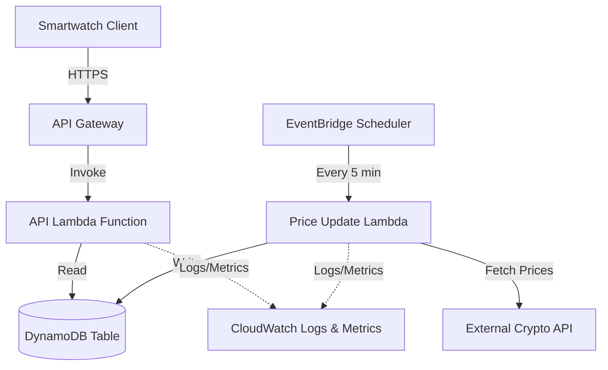

# 設計書

## 概要

crypto-watch-backendは、Lambda関数、API Gateway、DynamoDBを使用して構築されたサーバーレスAWSバックエンドです。このシステムは、スマートウォッチクライアント向けに最適化された暗号通貨価格データのRESTful APIを提供します。アーキテクチャは、スマートウォッチの制約に対応するため、低レイテンシ、効率的なキャッシング、最小限のデータ転送を重視しています。

バックエンドは2つの主要なLambda関数で構成されています：APIリクエストを処理する関数（読み取りパス）と、定期的に暗号通貨価格を更新する関数（書き込みパス）です。DynamoDBは、読み取り負荷の高いワークロードに最適化されたシングルテーブル設計のデータストアとして機能します。

## アーキテクチャ

### 高レベルアーキテクチャ



### コンポーネント間の相互作用フロー

**読み取りパス（APIリクエスト）:**
1. Smartwatch ClientがAPI GatewayにHTTPSリクエストを送信
2. API Gatewayがリクエストを検証し、API Lambdaを呼び出す
3. API LambdaがAPIキーを検証
4. API LambdaがDynamoDBでレート制限をチェック
5. API LambdaがDynamoDBからキャッシュされた価格データを取得
6. API Lambdaがフォーマットされたレスポンスをクライアントに返す

**書き込みパス（価格更新）:**
1. EventBridgeが5分ごとにPrice Update Lambdaをトリガー
2. Lambdaが外部暗号通貨APIから現在価格を取得
3. Lambdaがデータを変換・検証
4. Lambdaが更新された価格をタイムスタンプと共にDynamoDBに書き込む
5. LambdaがCloudWatchに成功/失敗メトリクスをログ記録

## コンポーネントとインターフェース

### API Gateway

**Endpoints:**
- `GET /prices` - Retrieve current prices for specified cryptocurrencies
- `GET /prices/{symbol}` - Retrieve price for a single cryptocurrency
- `GET /health` - Health check endpoint

**Request/Response Format:**

```typescript
// GET /prices?symbols=BTC,ETH,ADA
Request Headers:
  X-API-Key: string

Response (200 OK):
{
  "data": [
    {
      "symbol": "BTC",
      "name": "Bitcoin",
      "price": 45000.50,
      "change24h": 2.5,
      "marketCap": 850000000000,
      "lastUpdated": "2024-01-15T10:30:00Z"
    }
  ],
  "timestamp": "2024-01-15T10:30:05Z"
}

Response (401 Unauthorized):
{
  "error": "Invalid API key",
  "code": "UNAUTHORIZED"
}

Response (429 Too Many Requests):
{
  "error": "Rate limit exceeded",
  "code": "RATE_LIMIT_EXCEEDED",
  "retryAfter": 60
}
```

### API Lambda Function

**Responsibilities:**
- Validate API keys
- Enforce rate limiting
- Retrieve cryptocurrency data from DynamoDB
- Format responses for smartwatch clients
- Handle errors gracefully

**Environment Variables:**
- `DYNAMODB_TABLE_NAME` - Name of the DynamoDB table
- `RATE_LIMIT_PER_MINUTE` - Maximum requests per minute (default: 100)
- `CACHE_TTL_SECONDS` - Cache time-to-live (default: 300)

**Handler Signature:**
```python
def lambda_handler(event: dict, context: LambdaContext) -> dict:
    """
    Handles API Gateway requests for cryptocurrency prices.
    
    Args:
        event: API Gateway event containing request details
        context: Lambda execution context
        
    Returns:
        API Gateway response with status code, headers, and body
    """
```

### Price Update Lambda Function

**Responsibilities:**
- Fetch current cryptocurrency prices from external API
- Transform data into internal format
- Update DynamoDB with new prices
- Implement retry logic with exponential backoff
- Log metrics and errors

**Environment Variables:**
- `DYNAMODB_TABLE_NAME` - Name of the DynamoDB table
- `EXTERNAL_API_URL` - URL of external crypto price API
- `EXTERNAL_API_KEY` - API key for external service
- `SUPPORTED_SYMBOLS` - Comma-separated list of cryptocurrency symbols

**Handler Signature:**
```python
def lambda_handler(event: dict, context: LambdaContext) -> dict:
    """
    Fetches and updates cryptocurrency prices from external API.
    
    Args:
        event: EventBridge scheduled event
        context: Lambda execution context
        
    Returns:
        Status information about the update operation
    """
```

### EventBridge Scheduler

**Configuration:**
- Schedule: `rate(5 minutes)`
- Target: Price Update Lambda Function
- Retry Policy: 2 retries with exponential backoff

## Data Models

### DynamoDB Table Design

**Table Name:** `crypto-watch-data`

**Primary Key:**
- Partition Key: `PK` (String)
- Sort Key: `SK` (String)

**Global Secondary Index (GSI):**
- GSI Name: `GSI1`
- Partition Key: `GSI1PK` (String)
- Sort Key: `GSI1SK` (String)

**Access Patterns:**

| Access Pattern | Key Condition |
|----------------|---------------|
| Get price by symbol | PK = `PRICE#{symbol}`, SK = `METADATA` |
| Get all prices | PK begins_with `PRICE#` |
| Check rate limit | PK = `APIKEY#{key}`, SK = `RATELIMIT#{minute}` |
| Get API key details | PK = `APIKEY#{key}`, SK = `METADATA` |

**Item Types:**

```typescript
// Price Data Item
{
  "PK": "PRICE#BTC",
  "SK": "METADATA",
  "symbol": "BTC",
  "name": "Bitcoin",
  "price": 45000.50,
  "change24h": 2.5,
  "marketCap": 850000000000,
  "lastUpdated": "2024-01-15T10:30:00Z",
  "ttl": 1705318200  // Unix timestamp for item expiration
}

// API Key Item
{
  "PK": "APIKEY#abc123",
  "SK": "METADATA",
  "keyId": "abc123",
  "name": "Production App",
  "createdAt": "2024-01-01T00:00:00Z",
  "enabled": true
}

// Rate Limit Item
{
  "PK": "APIKEY#abc123",
  "SK": "RATELIMIT#202401151030",  // minute-level granularity
  "requestCount": 45,
  "ttl": 1705318260  // Expires after 1 hour
}
```

### External API Integration

**Provider:** CoinGecko API (or similar)

**Request Format:**
```
GET https://api.coingecko.com/api/v3/simple/price
  ?ids=bitcoin,ethereum,cardano
  &vs_currencies=usd
  &include_market_cap=true
  &include_24hr_change=true
```

**Response Transformation:**
```python
# External API response
{
  "bitcoin": {
    "usd": 45000.50,
    "usd_market_cap": 850000000000,
    "usd_24h_change": 2.5
  }
}

# Transformed to internal format
{
  "symbol": "BTC",
  "name": "Bitcoin",
  "price": 45000.50,
  "change24h": 2.5,
  "marketCap": 850000000000,
  "lastUpdated": "2024-01-15T10:30:00Z"
}
```

## Correctness Properties

*A property is a characteristic or behavior that should hold true across all valid executions of a system—essentially, a formal statement about what the system should do. Properties serve as the bridge between human-readable specifications and machine-verifiable correctness guarantees.*

### Property 1: Complete response data structure
*For any* valid cryptocurrency price data, the formatted API response should include symbol, name, price, 24-hour percentage change, market cap, and lastUpdated timestamp for each requested cryptocurrency.
**Validates: Requirements 1.2, 1.3**

### Property 2: Cache freshness determines data source
*For any* price data request, if cached data exists with a timestamp less than 5 minutes old, the system should return cached data without fetching from external API.
**Validates: Requirements 2.1**

### Property 3: Cache invalidation triggers refresh
*For any* price data request, if cached data is older than 5 minutes or does not exist, the system should fetch fresh data from the external API.
**Validates: Requirements 2.2**

### Property 4: Timestamp persistence
*For any* price update operation, the data stored in DynamoDB should include a lastUpdated timestamp and a TTL value.
**Validates: Requirements 2.4, 3.2**

### Property 5: Response compression
*For any* API request that includes Accept-Encoding headers indicating compression support, the response should be compressed accordingly.
**Validates: Requirements 2.5**

### Property 6: Retry with exponential backoff
*For any* external API call that fails, the system should retry up to 3 times with exponential backoff delays between attempts.
**Validates: Requirements 3.3**

### Property 7: Retry exhaustion handling
*For any* external API call where all retry attempts fail, the system should log the error and attempt to serve cached data if available.
**Validates: Requirements 3.4**

### Property 8: Update timestamp tracking
*For any* successful price update operation, the system should record the timestamp of the successful update for monitoring purposes.
**Validates: Requirements 3.5**

### Property 9: Authentication requirement
*For any* API endpoint request (except health check), the system should validate the presence and validity of an API key before processing the request.
**Validates: Requirements 4.1**

### Property 10: Rate limit enforcement
*For any* API key, after 100 requests within a 60-second window, subsequent requests should be rejected until the window resets.
**Validates: Requirements 4.3**

### Property 11: Request logging
*For any* API request received, the system should create a log entry containing request details, timestamp, and API key identifier.
**Validates: Requirements 4.5**

### Property 12: Error logging with details
*For any* error that occurs during request processing, the system should log detailed error information including error type, message, and stack trace.
**Validates: Requirements 5.2**

### Property 13: DynamoDB retry logic
*For any* DynamoDB operation that fails with a transient error, the system should retry the operation, and for permanent failures, should return an appropriate error response.
**Validates: Requirements 6.3**

### Property 14: Timeout fallback behavior
*For any* external API call that times out, the system should check for cached data and return it if available, or return an error response if no cache exists.
**Validates: Requirements 6.4**

### Property 15: Consistent error response format
*For any* error response from any endpoint, the response should follow a consistent JSON structure with "error", "code", and optional additional fields.
**Validates: Requirements 6.5**


## Error Handling

### Error Categories

**Client Errors (4xx):**
- 400 Bad Request: Invalid request parameters (missing symbols, invalid format)
- 401 Unauthorized: Missing or invalid API key
- 429 Too Many Requests: Rate limit exceeded

**Server Errors (5xx):**
- 500 Internal Server Error: Unexpected errors in Lambda execution
- 502 Bad Gateway: External API failures after all retries
- 503 Service Unavailable: DynamoDB unavailable or throttled

### Error Response Format

All error responses follow a consistent structure:

```json
{
  "error": "Human-readable error message",
  "code": "ERROR_CODE_CONSTANT",
  "timestamp": "2024-01-15T10:30:00Z",
  "requestId": "uuid-v4",
  "details": {
    // Optional additional context
  }
}
```

### Retry Strategy

**External API Calls:**
- Initial attempt
- Retry 1: Wait 1 second
- Retry 2: Wait 2 seconds
- Retry 3: Wait 4 seconds
- After all retries fail: Log error, serve cached data if available

**DynamoDB Operations:**
- Use AWS SDK built-in retry logic
- Exponential backoff with jitter
- Maximum 3 retry attempts
- Distinguish between throttling (retryable) and validation errors (not retryable)

### Timeout Configuration

- API Gateway timeout: 29 seconds (AWS maximum)
- Lambda timeout: 25 seconds (allows time for cleanup)
- External API call timeout: 5 seconds per attempt
- DynamoDB operation timeout: 3 seconds

## Testing Strategy

### Unit Testing

The backend will use Python's `unittest` framework for unit tests. Unit tests will focus on:

- Request validation logic (parameter parsing, format validation)
- Response formatting functions
- Data transformation between external API format and internal format
- Error response generation
- Rate limiting calculation logic
- Cache TTL calculation
- Retry backoff calculation

Example unit tests:
- Test that invalid symbols are rejected with appropriate error messages
- Test that response formatter includes all required fields
- Test that rate limit counter correctly tracks requests per minute
- Test that cache age calculation correctly determines freshness

### Property-Based Testing

The backend will use the `hypothesis` library for property-based testing in Python. Property-based tests will verify universal properties across many randomly generated inputs.

Configuration:
- Each property test should run a minimum of 100 iterations
- Tests should use appropriate strategies for generating test data (symbols, timestamps, API responses)
- Each property test must include a comment tag referencing the design document property

Example property tests:
- Property 1: Generate random cryptocurrency data and verify formatted responses always include all required fields
- Property 2: Generate random timestamps and verify cache logic correctly determines when to use cached vs fresh data
- Property 6: Generate random failure scenarios and verify retry logic executes correct number of attempts with proper delays
- Property 10: Generate random request patterns and verify rate limiting correctly enforces limits

Property test tags must follow this format:
```python
# Feature: crypto-watch-backend, Property 1: Complete response data structure
def test_response_includes_all_fields(self, crypto_data):
    ...
```

### Integration Testing

Integration tests will verify:
- End-to-end API request flow through API Gateway to Lambda to DynamoDB
- EventBridge triggering of Price Update Lambda
- External API integration with retry logic
- CloudWatch logging and metrics emission

Integration tests will use LocalStack or AWS SAM Local for local testing before deployment.

### Testing Approach

The testing strategy follows an implementation-first approach:
1. Implement the feature or component
2. Write unit tests for specific logic and edge cases
3. Write property-based tests for universal correctness properties
4. Run integration tests to verify component interactions
5. Fix any issues discovered by tests

This approach ensures that tests validate real functionality rather than mocked behavior, providing confidence in the actual implementation.

## Deployment Architecture

### Infrastructure as Code

The backend will be defined using AWS SAM (Serverless Application Model) with the following structure:

```yaml
# template.yaml
AWSTemplateFormatVersion: '2010-09-09'
Transform: AWS::Serverless-2016-10-31

Parameters:
  Environment:
    Type: String
    AllowedValues: [dev, staging, prod]
  ExternalApiKey:
    Type: String
    NoEcho: true

Resources:
  CryptoWatchTable:
    Type: AWS::DynamoDB::Table
    
  ApiFunction:
    Type: AWS::Serverless::Function
    
  PriceUpdateFunction:
    Type: AWS::Serverless::Function
    
  ApiGateway:
    Type: AWS::Serverless::Api
    
  UpdateSchedule:
    Type: AWS::Events::Rule
```

### Environment Configuration

**Development:**
- Reduced DynamoDB capacity (on-demand)
- Verbose logging enabled
- Shorter cache TTL (2 minutes) for faster testing
- Rate limit: 50 requests/minute

**Staging:**
- Production-like configuration
- Standard logging
- Standard cache TTL (5 minutes)
- Rate limit: 100 requests/minute

**Production:**
- Optimized DynamoDB capacity with auto-scaling
- Error-level logging only
- Standard cache TTL (5 minutes)
- Rate limit: 100 requests/minute
- CloudWatch alarms enabled

### Deployment Process

1. Code changes pushed to repository
2. CI/CD pipeline runs tests
3. SAM build creates deployment package
4. SAM deploy updates CloudFormation stack
5. CloudFormation performs rolling update of Lambda functions
6. Health check validates deployment
7. Rollback triggered if health check fails

### Monitoring and Observability

**CloudWatch Metrics:**
- API request count (per endpoint, per status code)
- API latency (p50, p95, p99)
- Lambda invocation count and duration
- Lambda error count and throttles
- DynamoDB read/write capacity usage
- External API call success/failure rate

**CloudWatch Alarms:**
- API error rate > 5% for 5 minutes
- Lambda error rate > 1% for 5 minutes
- DynamoDB throttling events
- External API failure rate > 50% for 10 minutes

**CloudWatch Logs:**
- Structured JSON logging
- Log groups per Lambda function
- Retention: 30 days (dev), 90 days (prod)
- Log level: DEBUG (dev), INFO (staging), ERROR (prod)

## Security Considerations

### API Key Management

- API keys stored in DynamoDB with hashed values
- Keys generated using cryptographically secure random generation
- Key rotation supported through admin API (future enhancement)
- Keys can be enabled/disabled without deletion

### Data Protection

- All data in transit encrypted via HTTPS (TLS 1.2+)
- DynamoDB encryption at rest enabled
- Lambda environment variables encrypted with KMS
- No sensitive data logged (API keys masked in logs)

### IAM Permissions

Lambda functions follow principle of least privilege:
- API Lambda: Read-only access to DynamoDB
- Update Lambda: Read-write access to DynamoDB, no API Gateway access
- No Lambda has permission to modify IAM roles or policies

### Rate Limiting

Rate limiting prevents abuse and controls costs:
- Per-API-key limits prevent individual client abuse
- Global limits (future enhancement) prevent overall system overload
- Rate limit data stored with TTL to automatically clean up old records

## Performance Optimization

### Caching Strategy

- 5-minute cache TTL balances freshness with API call costs
- Cache stored in DynamoDB for persistence across Lambda invocations
- Cache key includes symbol for granular invalidation
- Conditional cache refresh reduces unnecessary external API calls

### Response Optimization

- Minimal JSON response structure (no unnecessary fields)
- Numeric values rounded to 2 decimal places for price, percentage
- Timestamps in ISO 8601 format for universal compatibility
- Optional gzip compression for clients that support it

### Lambda Optimization

- Python 3.11 runtime for performance
- Minimal dependencies to reduce cold start time
- Connection pooling for DynamoDB client
- Environment variable caching
- Provisioned concurrency for production (optional)

### DynamoDB Optimization

- Single-table design reduces number of queries
- Efficient key structure for common access patterns
- TTL enabled for automatic cleanup of old data
- On-demand billing for unpredictable workloads (or provisioned with auto-scaling)
