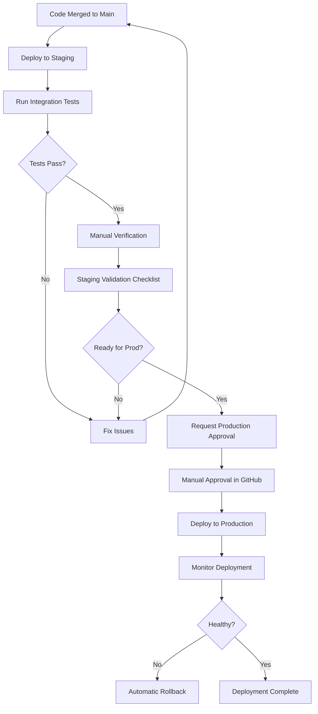

# Staging to Production Promotion Flow

## Overview

This document describes the process for promoting changes from staging to production environment.

## Promotion Workflow



## Staging Validation Checklist

Before promoting to production, verify the following in staging:

### Functional Testing
- [ ] All API endpoints respond correctly
- [ ] Authentication works with valid API keys
- [ ] Rate limiting enforces limits correctly
- [ ] Health check endpoint returns accurate status
- [ ] Error responses follow consistent format
- [ ] Cache behavior works as expected (fresh/stale data)

### Performance Testing
- [ ] API response time < 2 seconds for price requests
- [ ] Health check response time < 500ms
- [ ] No memory leaks in Lambda functions
- [ ] DynamoDB read/write latency acceptable
- [ ] External API integration performs well

### Data Integrity
- [ ] Price data updates every 5 minutes
- [ ] Timestamps are accurate and consistent
- [ ] All required fields present in responses
- [ ] Data precision correct (price: 2 decimals, change: 1 decimal)

### Security
- [ ] Invalid API keys are rejected (401)
- [ ] Missing API keys are rejected (401)
- [ ] Rate limits prevent abuse (429)
- [ ] API keys are masked in logs
- [ ] HTTPS enforced for all requests

### Monitoring
- [ ] CloudWatch Logs capturing all events
- [ ] CloudWatch Metrics being published
- [ ] CloudWatch Alarms configured correctly
- [ ] No unexpected errors in logs
- [ ] Alarm thresholds appropriate

### Documentation
- [ ] API documentation up to date
- [ ] Deployment notes prepared
- [ ] Known issues documented
- [ ] Rollback plan ready

## Manual Approval Process

### 1. Request Approval

After staging validation, create a production deployment request:

```markdown
## Production Deployment Request

**Date**: 2024-01-15
**Requestor**: @username
**Changes**: Brief description of changes

### Staging Validation
- [x] All checklist items completed
- [x] No critical issues found
- [x] Performance acceptable

### Deployment Details
- **Estimated Duration**: 15 minutes
- **Traffic Impact**: Gradual (10% per minute)
- **Rollback Plan**: Automatic via CloudWatch Alarms

### Approval Required
@team-lead @ops-lead
```

### 2. GitHub Environment Approval

Production deployment requires manual approval in GitHub Actions:

1. Navigate to Actions tab
2. Find the deployment workflow run
3. Click "Review deployments"
4. Select "production" environment
5. Add approval comment
6. Click "Approve and deploy"

### 3. Deployment Monitoring

During deployment, monitor:

```bash
# Watch deployment status
watch -n 10 'aws deploy get-deployment \
  --deployment-id <id> \
  --query "deploymentInfo.status"'

# Monitor CloudWatch Alarms
watch -n 10 'aws cloudwatch describe-alarms \
  --alarm-name-prefix "crypto-watch-backend-prod" \
  --state-value ALARM \
  --query "MetricAlarms[*].[AlarmName,StateValue]" \
  --output table'

# Check API health
watch -n 30 'curl -s https://api.example.com/health | jq'
```

## Rollback Procedures

### Automatic Rollback

Automatic rollback is triggered by CloudWatch Alarms:
- Lambda error rate > 5% for 2 minutes
- API Gateway 5xx rate > 10% for 2 minutes
- Lambda throttles > 10 in 1 minute

### Manual Rollback

If manual rollback is needed:

```bash
# Option 1: Rollback via CodeDeploy
aws deploy stop-deployment \
  --deployment-id <deployment-id> \
  --auto-rollback-enabled

# Option 2: Redeploy previous version
sam deploy \
  --config-file samconfig-prod.toml \
  --config-env prod \
  --parameter-overrides "Version=<previous-version>"

# Option 3: Update Lambda alias
aws lambda update-alias \
  --function-name crypto-watch-api-prod \
  --name live \
  --function-version <previous-version>
```

### Post-Rollback Actions

1. Investigate root cause
2. Generate incident report
3. Fix issues in development
4. Re-test in staging
5. Schedule new production deployment

## Deployment History and Version Management

### Tagging Strategy

```bash
# Tag releases
git tag -a v1.2.3 -m "Release v1.2.3: Add new features"
git push origin v1.2.3

# Tag format: v<major>.<minor>.<patch>
# major: Breaking changes
# minor: New features (backward compatible)
# patch: Bug fixes
```

### Deployment Log

Maintain a deployment log in `CHANGELOG.md`:

```markdown
## [1.2.3] - 2024-01-15

### Added
- New cryptocurrency support (TRX, FIL)
- Response compression for mobile clients

### Changed
- Improved cache invalidation logic
- Updated rate limit to 100 req/min

### Fixed
- Fixed timestamp timezone issue
- Corrected error response format

### Deployment
- Staging: 2024-01-14 10:00 UTC
- Production: 2024-01-15 14:00 UTC
- Rollback: None
```

### Version Tracking

Track deployed versions in DynamoDB:

```python
# Store deployment metadata
{
  "PK": "DEPLOYMENT#prod",
  "SK": "VERSION#1.2.3",
  "version": "1.2.3",
  "deployedAt": "2024-01-15T14:00:00Z",
  "deployedBy": "github-actions",
  "gitCommit": "abc123def456",
  "status": "active"
}
```

## Pre-Production Checklist

Complete before requesting production approval:

### Code Quality
- [ ] All tests passing (unit, property, integration)
- [ ] Code coverage > 80%
- [ ] No linting errors
- [ ] Type checking passed
- [ ] Security scan clean

### Staging Verification
- [ ] Deployed to staging successfully
- [ ] Staging validation checklist completed
- [ ] Performance benchmarks met
- [ ] No errors in staging logs (24 hours)

### Documentation
- [ ] CHANGELOG.md updated
- [ ] API documentation updated
- [ ] README updated if needed
- [ ] Deployment notes prepared

### Communication
- [ ] Team notified of upcoming deployment
- [ ] Stakeholders informed
- [ ] Maintenance window scheduled (if needed)
- [ ] Rollback plan communicated

### Approval
- [ ] Technical lead approval
- [ ] Operations lead approval
- [ ] Product owner approval (for major changes)

## Post-Deployment Verification

After production deployment:

### Immediate (0-15 minutes)
- [ ] Health check endpoint returns 200
- [ ] API endpoints respond correctly
- [ ] No CloudWatch Alarms triggered
- [ ] Traffic shifting completed successfully

### Short-term (15-60 minutes)
- [ ] Monitor error rates
- [ ] Check response times
- [ ] Verify price updates occurring
- [ ] Review CloudWatch Logs

### Long-term (1-24 hours)
- [ ] Monitor for any anomalies
- [ ] Check rate limiting behavior
- [ ] Verify cache performance
- [ ] Review metrics dashboards

## Emergency Procedures

### Critical Issue During Deployment

1. **Stop deployment immediately**
   ```bash
   aws deploy stop-deployment --deployment-id <id>
   ```

2. **Assess impact**
   - Check error rates
   - Review affected users
   - Determine severity

3. **Communicate**
   - Notify team via Slack
   - Update status page
   - Inform stakeholders

4. **Rollback or fix forward**
   - If minor: Fix forward with hotfix
   - If major: Rollback immediately

### Post-Incident Review

After any incident:

1. Schedule post-mortem meeting
2. Document timeline of events
3. Identify root cause
4. Create action items
5. Update procedures
6. Share learnings with team

## Best Practices

1. **Deploy during low-traffic periods**
2. **Have team available during deployment**
3. **Monitor actively for first hour**
4. **Keep rollback plan ready**
5. **Document everything**
6. **Learn from each deployment**
7. **Automate where possible**
8. **Test rollback procedures regularly**

## References

- [Deployment Script](../scripts/deploy.sh)
- [Rollback Verification](./ROLLBACK_VERIFICATION.md)
- [API Key Management](./API_KEY_MANAGEMENT.md)
- [Operations Manual](./OPERATIONS.md)
